# containers

## HW 1

### Описание задания

В рамках ДЗ реализовано мини-приложение на FastAPI (TODO-сервис) и два Dockerfile:

* `Dockerfile.good` - **хороший** Dockerfile, оформленный по best practices.
* `Dockerfile.bad` - **плохой**, но рабочий Dockerfile, содержащий намеренные bad practices.

---

### Плохие практики в `Dockerfile.bad` и их исправление в `Dockerfile.good`

| # | Плохая практика в `Dockerfile.bad`                                  | Почему это плохо                                                                                                       | Как исправлено в `Dockerfile.good`                                                                                                                            |
| - | ------------------------------------------------------------------- | ---------------------------------------------------------------------------------------------------------------------- | ------------------------------------------------------------------------------------------------------------------------------------------------------------- |
| 1 | `FROM python:3.11` - тяжёлый базовый образ без суффикса `-slim`     | Больше слоёв, лишние системные пакеты, большой размер образа → дольше скачивать и деплоить                             | Используется облегчённый образ `FROM python:3.11-slim` в обоих стейджах                                                                                       |
| 2 | Работа под root (пользователь по умолчанию)                         | Любая уязвимость в приложении даёт root-доступ внутри контейнера, сложнее ограничивать права                           | Создаётся отдельный пользователь: `groupadd app`, `useradd app` и `USER app` в финальном стейдже                                                              |
| 3 | `COPY . /app` - копирование всего проекта целиком                   | В образ попадает всё подряд: .git, venv, артефакты IDE и т.д. Увеличивает размер и время сборки                        | В хорошем Dockerfile отдельно копируются `requirements.txt` (для кэширования) и только нужные исходники (`app.py`)                                            |
| 4 | Установка зависимостей напрямую в runtime: `RUN pip install …`      | Все build-артефакты и временные файлы остаются в финальном образе, увеличивая его размер; нельзя переиспользовать слои | Используется многоступенчатая сборка: зависимости ставятся в `builder`-стейдже (`pip install --prefix=/install`), затем в runtime копируется только результат |
| 5 | Нет разделения на builder и runtime (отсутствует multi-stage build) | Финальный образ содержит всё - компиляторы, кэш, временные файлы; сложнее обновлять и поддерживать                     | Реализованы два стейджа: `builder` (с `gcc` и pip-установкой) и минимальный runtime-образ без лишних инструментов                                             |
| 6 | Нет `EXPOSE`, нет документации порта                                | Докер-образ не документирует, какой порт слушает приложение; другим разработчикам сложнее использовать образ           | В хорошем Dockerfile явно указано `EXPOSE 8000`                                                                                                               |
| 7 | Жёстко захардкоженный `CMD uvicorn app:app …` без массива           | Строковый `CMD` сложнее переопределять и менее прозрачен; shell-формат может вести себя неожиданно                     | В хорошем Dockerfile используется exec-форма: `CMD ["uvicorn", "app:app", "--host", "0.0.0.0", "--port", "8000"]`                                             |

---

### Плохие практики использования контейнера

1. **Запуск без монтирования volume для данных**

   Если запускать контейнер без `-v ./data:/app/data`, все данные, которые теоретически могли бы сохраняться в файловую систему приложения, будут жить только внутри контейнера.
   При пересоздании/обновлении контейнера они будут потеряны.

   **Хорошая практика:**
   Всегда использовать volume для данных приложения, даже если сейчас они хранятся только в памяти:

   ```bash
   docker run -d \
     -p 8000:8000 \
     -v ./data:/app/data \
     --name todo \
     todo-app
   ```

2. **Использование контейнера как “вечной виртуальной машины”**

   Плохая практика - заходить внутрь контейнера (`docker exec -it ... sh`), руками менять файлы, ставить пакеты и рассчитывать, что это “так и останется”.
   После пересборки/перезапуска все ручные изменения пропадут, и среда перестанет быть воспроизводимой.

   **Хорошая практика:**
   Все изменения описывать в Dockerfile и/или compose-файлах, а не “чинить руками внутри контейнера”.

---

### Когда не стоит использовать контейнеры в целом

1. **Когда критична максимальная “голая” производительность и минимальная задержка**

   Примеры: high-frequency trading, жёсткий real-time, специализированные системы обработки сигналов, где каждый микросекунд важен.
   В таких случаях даже небольшая абстракция и накладные расходы на контейнеризацию могут быть нежелательны - предпочтительнее bare-metal или максимально лёгкая конфигурация без дополнительной изоляции.

2. **Когда требуется прямой и нестандартный доступ к оборудованию / драйверам**

   Примеры: проприетарные драйверы, специфическое железо, сложные USB/PCIe-устройства, кастомные ядра.
   Да, часть таких сценариев можно решить через `--device`, специальные runtime’ы и т.п., но иногда проще и надёжнее развернуть приложение напрямую на хост-системе, без контейнеров.

---

### Примеры использования

```bash
# Сборка образа
docker build -f Dockerfile.good -t todo-good .

# Создание директории под данные
mkdir -p data

# Запуск с пробросом порта и volume
docker run -d \
  -p 8000:8000 \
  -v ./data:/app/data \
  --name todo-good \
  todo-good
```

Проверка:

* Healthcheck: `http://localhost:8000/health`
* Swagger UI: `http://localhost:8000/docs`

Оба контейнера запускают одно и то же FastAPI-приложение, но хороший Dockerfile делает это безопаснее, предсказуемее и с меньшим размером образа.

## HW 2

````markdown
# HW 2 -- docker-compose

## Описание

Во второй лабораторной работе поверх приложения из ЛР 1 собран docker-compose-проект из трёх сервисов:

- **db** -PostgreSQL.
- **init-db** - одноразовый init-сервис, который ждёт готовности БД и создаёт служебную таблицу.
- **app** - FastAPI-приложение (TODO-сервис), собирается из `Dockerfile.good`.

Все сервисы подключены к одной общей сети `app-net` и используют переменные окружения из файла `.env`.

## Соответствие требованиям

Выполнены следующие пункты задания:

- Минимум **1 init + 2 app-сервиса**: `init-db`, `db`, `app`.
- **Автоматическая сборка образа** приложения из `Dockerfile.good` с присвоением имени `todo-good:latest` (через `build` + `image`).
- У всех сервисов заданы **жёсткие имена контейнеров** (`container_name`).
- Используется **`depends_on`**:
  - `db` → для `init-db` и `app`,
  - `app` также зависит от успешного завершения `init-db`.
- Минимум один сервис с **volume**:
  - `db`: `todo_db_data:/var/lib/postgresql/data`,
  - `app`: `./data:/app/data`.
- Минимум один сервис с **пробросом порта наружу**:
  - `app`: `${APP_PORT}:8000`.
- Минимум один сервис с ключом **`command`**:
  - `init-db` выполняет скрипт инициализации БД через `bash -c` и `psql`.
- Добавлены **healthcheck’и**:
  - для `db` (проверка `pg_isready`),
  - для `app` (HTTP-запрос к `/health`).
- Все переменные окружения вынесены в файл **`.env`** (например: `POSTGRES_DB`, `POSTGRES_USER`, `POSTGRES_PASSWORD`, `APP_PORT`).
- В `docker-compose.yml` явно объявлена одна общая **сеть** `app-net` и все сервисы подключены к ней.

## Запуск и остановка

Запуск всего проекта:

```bash
docker compose up --build
````

Приложение будет доступно по адресам:

* `http://localhost:8000/health`
* `http://localhost:8000/docs`

Остановка:

```bash
docker compose down
# с удалением данных БД:
# docker compose down -v
```

---

## Ответы на вопросы

### Можно ли ограничивать ресурсы (память/CPU) для сервисов в docker-compose.yml?

**Да, можно.**

Возможные варианты:

* В Swarm-режиме (Compose v3) через секцию `deploy.resources`:

  ```yaml
  services:
    app:
      deploy:
        resources:
          limits:
            cpus: "0.5"
            memory: 512M
  ```

* В обычном `docker compose up` можно использовать поля уровня сервиса, поддерживаемые вашей версией Docker/Compose (например `cpus`, `mem_limit` и т.п.). Конкретный синтаксис зависит от версии, но в целом **ресурсы можно задавать в compose-файле**.

### Как запустить только определённый сервис из docker-compose.yml, не поднимая остальные?

Нужно указать имя сервиса в команде:

```bash
docker compose up app
```

Чтобы запустить несколько выбранных сервисов:

```bash
docker compose up app db
```

В этом случае будут подняты только указанные сервисы (и необходимые для них зависимости).

# HW 3

## Описание

В третьей лабораторной работе в локальном кластере Kubernetes (minikube) развернуты два связанных сервиса:

* PostgreSQL - база данных.
* Nextcloud - веб-приложение, использующее PostgreSQL как бекенд.

Конфигурация выполнена в соответсвии с заданием:

* параметры вынесены в ConfigMap;
* чувствительные данные (пароли / логины) вынесены в Secret;
* для Nextcloud добавлены liveness и readiness-пробы;
* доступ к Nextcloud обеспечивается через Service типа NodePort.

Все манифесты находятся в корне проекта:

* pg_configmap.yml
* pg_secret.yml
* pg_service.yml
* pg_deployment.yml
* nextcloud_configmap.yml
* nextcloud.yml

## Соответствие требованиям

Выполнены следующие пункты задания:

* Подняты два сервиса в Kubernetes-кластере:

  * PostgreSQL,
  * Nextcloud.

* Для PostgreSQL:

  * создана ConfigMap postgres-configmap c параметром POSTGRES_DB;
  * создан Secret postgres-secret c POSTGRES_USER и POSTGRES_PASSWORD
    (перенесены из ConfigMap в Secret в соответствии с заданием);
  * создан Service postgres-service (тип NodePort) для доступа к БД внутри кластера;
  * создан Deployment postgres с:

    * ресурсными лимитами/requests по CPU и памяти,
    * переменными окружения:

      * POSTGRES_DB из postgres-configmap,
      * POSTGRES_USER и POSTGRES_PASSWORD из postgres-secret через secretKeyRef.

* Для Nextcloud:

  * создан Secret nextcloud-secret c  NEXTCLOUD_ADMIN_PASSWORD;
  * создана ConfigMap nextcloud-configmap с параметрами:

    *  NEXTCLOUD_UPDATE,
    *  ALLOW_EMPTY_PASSWORD,
    *  POSTGRES_HOST,
    *  NEXTCLOUD_TRUSTED_DOMAINS,
    *  NEXTCLOUD_ADMIN_USER;
  * создан Deployment nextcloud c:

    * ресурсными лимитами и requests;
    * подключением переменных из ConfigMap через:

      ```yaml
      envFrom:
        - configMapRef:
            name: nextcloud-configmap
      ```
    * подключением параметров БД (POSTGRES_DB, POSTGRES_USER, POSTGRES_PASSWORD) через configMapKeyRef и secretKeyRef;
    * подключением пароля администратора Nextcloud из nextcloud-secret.

* Для Nextcloud добавлены livenessProbe и readinessProbe:

  * тип проверки: httpGet на порт 80, путь /;
  * заданы initialDelaySeconds и periodSeconds для корректной проверки готовности приложения

* Для Nextcloud создаётся Service типа NodePort:

  * либо отдельным манифестом,
  * либо командой:

    ```bash
    kubectl expose deployment nextcloud --type=NodePort --port=80
    ```

* Для всех сущностей (ConfigMap, Secret, Deployment, Service) корректность работы проверена командами:

  * kubectl get ...
  * kubectl describe pod ...
  * kubectl logs ...

## Запуск и остановка

### Запуск

1. Запустить кластер minikube:

   ```bash
   minikube start --driver=docker
   ```

2. Применить манифесты PostgreSQL:

   ```bash
   kubectl apply -f pg_configmap.yml
   kubectl apply -f pg_secret.yml
   kubectl apply -f pg_service.yml
   kubectl apply -f pg_deployment.yml
   ```

3. Применить манифесты Nextcloud:

   ```bash
   kubectl apply -f nextcloud_configmap.yml
   kubectl apply -f nextcloud.yml
   ```

4. Создать сервис для Nextcloud (если не описан в YAML):

   ```bash
   kubectl expose deployment nextcloud --type=NodePort --port=80
   ```

5. Проверить, что все поды запущены:

   ```bash
   kubectl get pods
   ```

6. Открыть Nextcloud в браузере через minikube:

   ```bash
   minikube service nextcloud
   ```

   Войти под администратором (NEXTCLOUD_ADMIN_USER из ConfigMap и NEXTCLOUD_ADMIN_PASSWORD из Secret).

### Остановка

Остановить развернутые ресурсы:

```bash
kubectl delete -f nextcloud.yml
kubectl delete -f nextcloud_configmap.yml
kubectl delete -f pg_deployment.yml
kubectl delete -f pg_service.yml
kubectl delete -f pg_secret.yml
kubectl delete -f pg_configmap.yml
```

Остановить кластер minikube:

```bash
minikube stop
```

### Доп вопросы

#### 1) Важен ли порядок выполнения этих манифестов? Почему?

**Да, порядок важен из-за зависимостей.** 

* **ConfigMap/Secret -> Deployment:** если деплоймент (Pod) ссылается на ещё не созданные `ConfigMap`/`Secret` (через `envFrom`, `configMapKeyRef`, `secretKeyRef`), pod обычно **не стартует/получит ошибку конфигурации**, пока эти объекты не появятся. Это напрямую относится к вашей схеме, где Nextcloud и Postgres берут настройки из ConfigMap/Secret.  
* **Service <-> Deployment:** Service можно применить и до, и после Deployment - он создастся в любом случае, но **реальный трафик пойдёт только когда появятся pod’ы**, подходящие под `selector` (т.е. появятся endpoints). 
* **Практически правильный порядок для этой лабы:**

  1. `pg_configmap.yml`, `pg_secret.yml` -> 2) `pg_service.yml` -> 3) `pg_deployment.yml` -> 4) `nextcloud_configmap.yml` -> 5) `nextcloud.yml`.
     Так Nextcloud не будет уходить в ошибки/рестарты из-за того, что Postgres (или его настройки) ещё не подняты. 


### 2) Что (и почему) произойдёт, если отскейлить количество реплик `postgres-deployment` в `0`, затем обратно в `1`, после чего попробовать снова зайти на Nextcloud?

* При `replicas = 0` Kubernetes удалит все pod Postgres -> **БД станет недоступна** (у `postgres-service` пропадут endpoints). Nextcloud при попытке открыть веб-интерфейс/выполнить запросы начнёт получать ошибки подключения к БД (таймаут/500), потому что его бекенд зависит от PostgreSQL.  
* При возврате `replicas = 1` Kubernetes создаст **новый pod Postgres**. Дальше есть два варианта:

  * **Если у Postgres нет постоянного хранилища (PVC/volume)**, то после пересоздания pod’а БД поднимется "с нуля" (пустая). Тогда Nextcloud, скорее всего, **не сможет “узнать” свою старую БД**: может показать страницу первичной установки заново или ошибки вида "нет таблиц/неверная схема", и вход в старую систему не заработает без восстановления данных.
  * **Если есть постоянное хранилище**, то данные БД сохранятся, и после кратковременной недоступности Nextcloud обычно продолжит работать, как только Postgres снова станет Ready (иногда нужно просто чуть подождать).

## Скриншоты выполнения лабораторной работы

Ниже представлены скриншоты, подтверждающие выполнение всех этапов лабораторной работы:

* сборку кастомного Docker-образа Nginx;
* развертывание PostgreSQL с использованием ConfigMap и Secret;
* развертывание Nextcloud с подключением к базе данных PostgreSQL и использованием PersistentVolumeClaim;
* корректную работу Kubernetes-ресурсов (Pods, Deployments, ReplicaSets, Services);
* доступность сервисов через NodePort;
* работу Kubernetes Dashboard;
* запуск кластера Minikube внутри Docker Desktop.

Все pod’ы находятся в состоянии `Running`, сервисы успешно созданы, приложение Nextcloud доступно извне кластера.

---

### Скриншоты

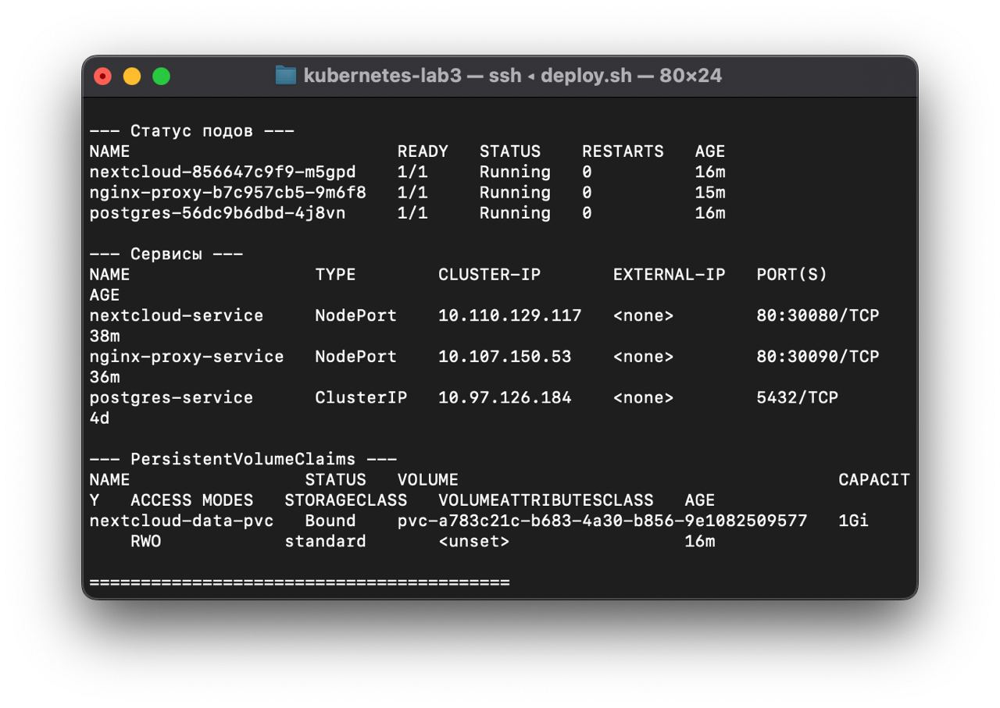
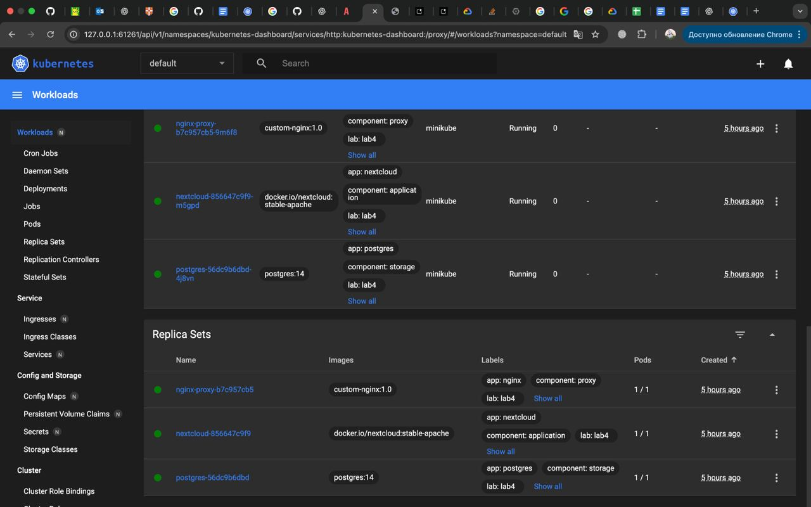
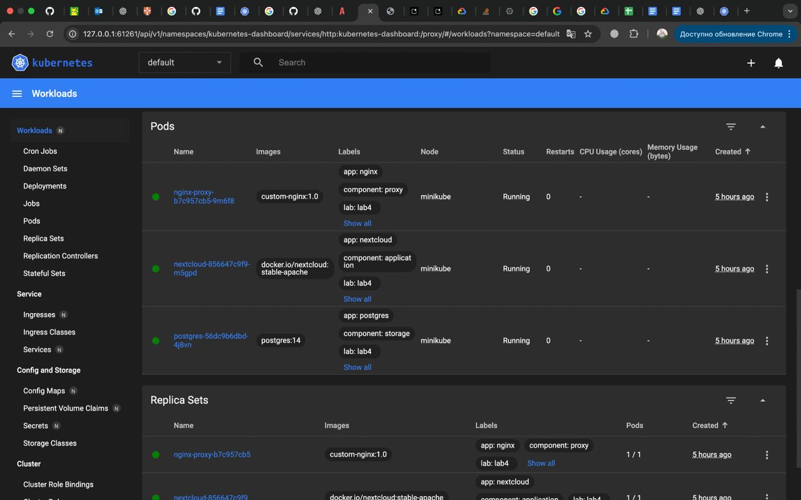
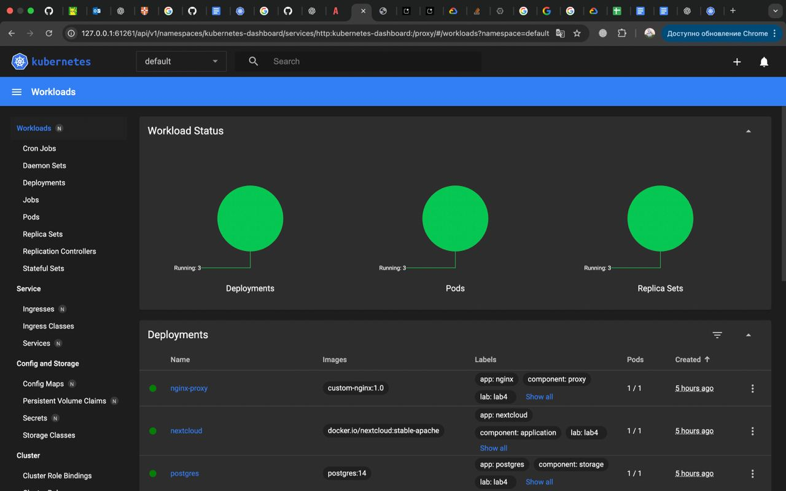
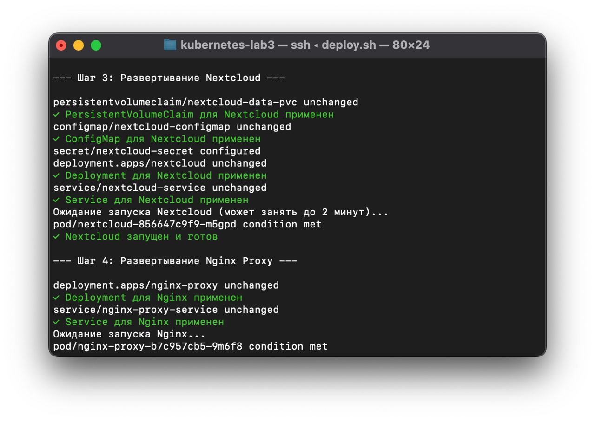
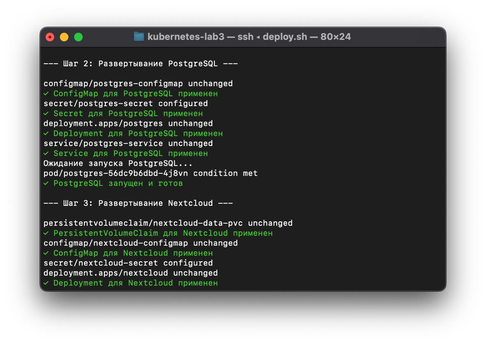
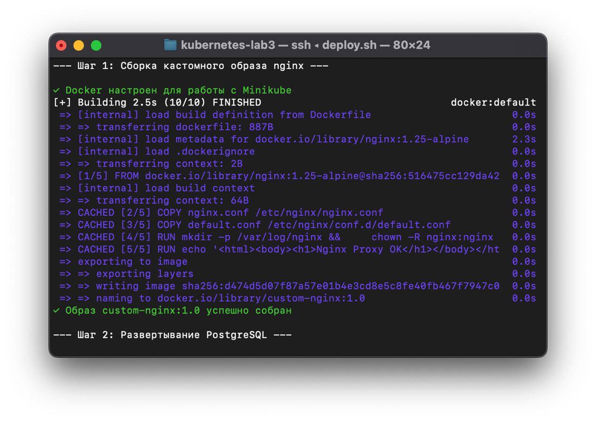
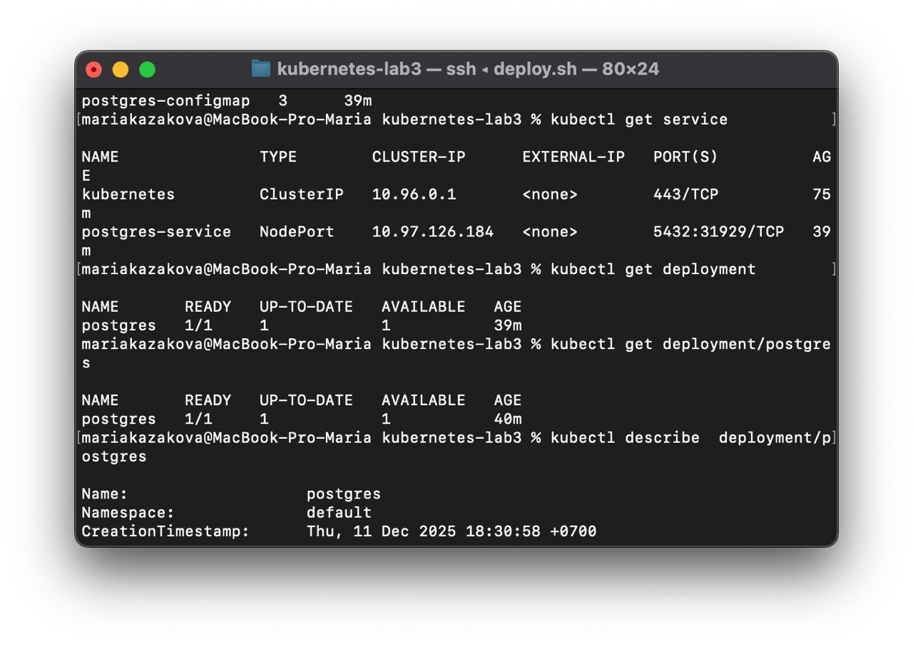
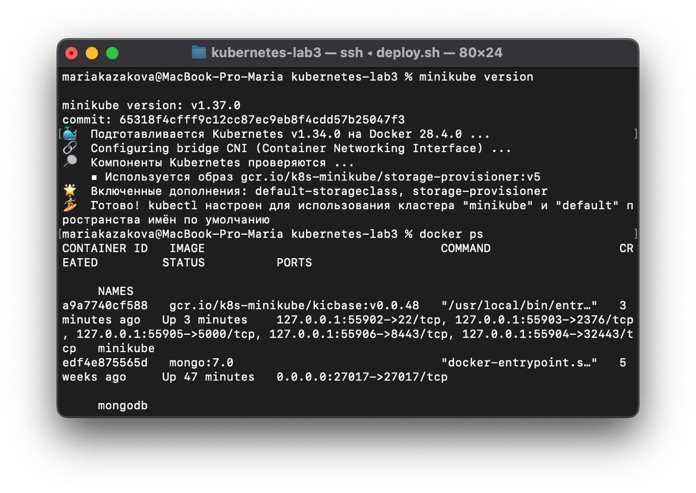
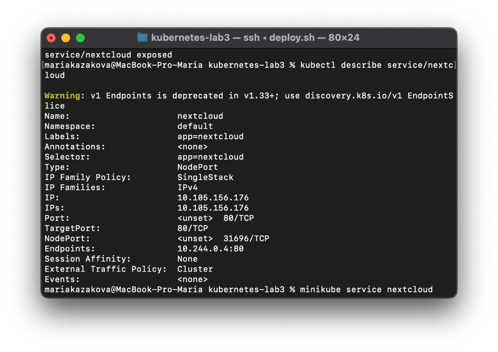
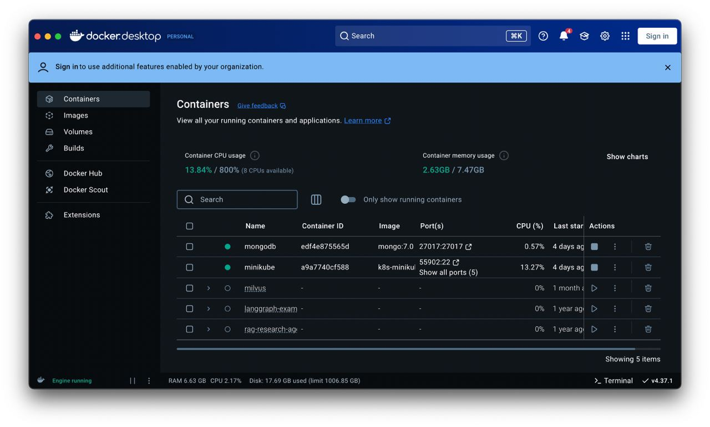
